## 800qps 下的状态

最原始的创建账号的方法：

``` c#
using (var db = new DBSet())
{
    using (var tran = db.Database.BeginTransaction())
    {
        try
        {
            var exits = db.PlatformAccounts.FirstOrDefault(o => o.Name == request.Name);
            if (exits == null)
            {
                exits = new PlatformAccount
                {
                    Name = request.Name,
                    Password = request.Password,
                };

                db.PlatformAccounts.Add(exits);
                db.SaveChanges();
                tran.Commit();
            }
            else
            {
                return Response<string>.Error("账号已存在!");
            }
        }
        catch(Exception ex)
        {
            _logger.LogError(ex, "create user fail. {0}", request.Name);
            tran.Rollback();
        }
    }
}

```

测试时的代码

``` c#

// 10w 次创建
int 线程数量 = 10;
int 新增数量 = 10000;

Stopwatch allTime = Stopwatch.StartNew();

for (var i = 0; i < 线程数量; i++)
{
    Thread thread = new Thread(o =>
    {
        Runtest(新增数量);
    });
    thread.Start();
    threads.Add(thread);
}

Thread.Sleep(10000);
for(var i =0;i < threads.Count; i++)
{
    threads[i].Join();
}

allTime.Stop();

Console.WriteLine("allTime: {0} min qps:{1}", 
    allTime.Elapsed.TotalMinutes, 
    (int)((线程数量 * 新增数量) / allTime.Elapsed.TotalSeconds));

```

数据库插入前有35w条记录

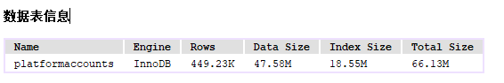  

10线程插入10w条用时2分钟 800 的qps
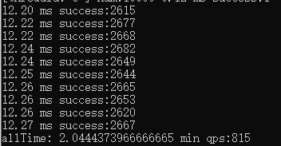  

cpu 的执行，感觉只使用了一半的资源
  

docker 虚拟机里mysql的虚拟机就更加奇怪，在初始启动的时候，cpu还是能跑满，但是慢慢的就降低下来了。
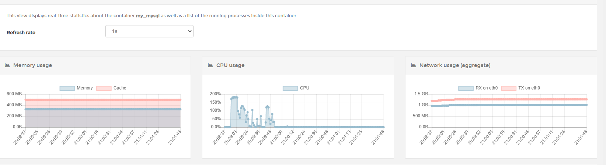  

先改进了一下输出，感觉没有不平滑的地方。
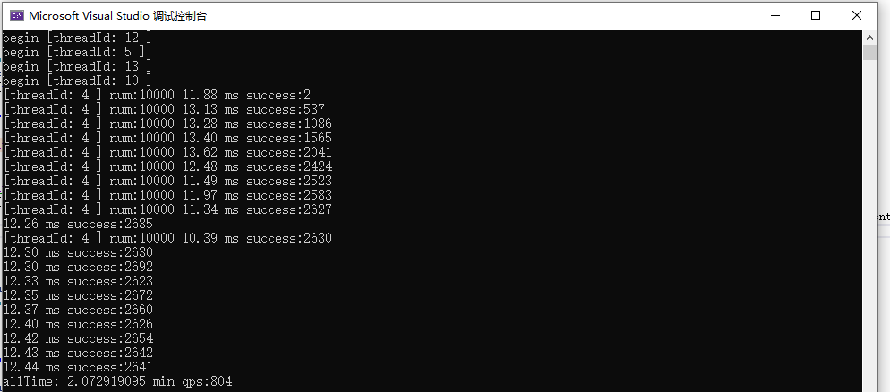  

整个时候，把创建线程的数量，从10个降低到3个，qps，一下子就降低到300。
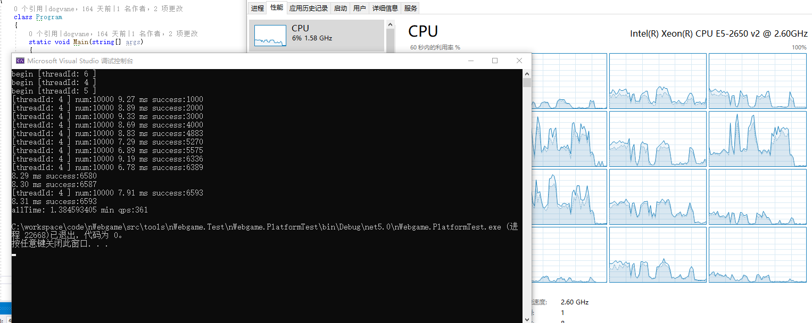  

mysql的cpu 也是到后段出问题。
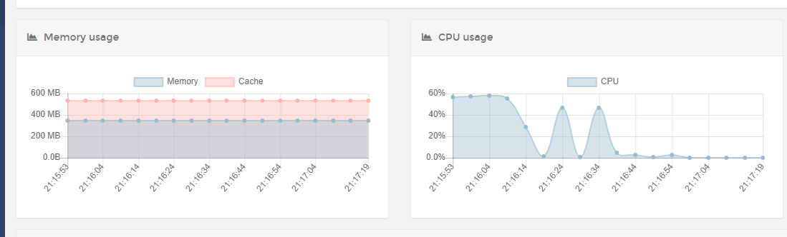  

所以，回过头观察了一下执行数据，发现前几千次的执行创建对象都是100%成功，但是到后面的执行次数，则会发现创建的数据有冲突了。
所以，先改造了一下账号随机生成的方式，看看效果。

```  c#

private static int randIndex = new Random().Next(1000);

Random rand = new Random(randIndex += 10086);

var name = "13" +  rand.Next(1, 9)  + rand.Next(1000, 9999) + rand.Next(1000, 9999);

```
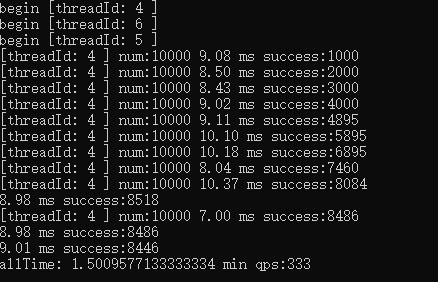  

随机生成的效果比之前好了一些，但是仍然没有到达100%创建成功的情况，因此创建账户的方式还是得再改造一次。

``` c#

HashSet<string> allNames = new HashSet<string>(线程数量 * 新增数量 + 10);

var rand = new Random();

while (allNames.Count < 线程数量 * 新增数量)
{
    var name = "13" + rand.Next(1, 9) + rand.Next(1000, 9999) + rand.Next(1000, 9999);
    allNames.Add(name);
}

var ar = allNames.ToArray();

Stopwatch allTime = Stopwatch.StartNew();

for (var i = 0; i < 线程数量; i++)
{
    var newNames =  ar.Skip(i * 新增数量).Take(新增数量).ToArray();
    Thread thread = new Thread(o =>
    {
        Runtest(新增数量, newNames);
    });
    thread.Start();
    threads.Add(thread);
}

```

感觉，随机生成的账号，还是和现在数据库里的数据有冲突，这里先试试删除数据后再试试。

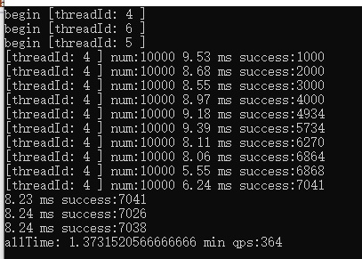  

这结果，让我炸裂了，删除数据后还是这样。。。

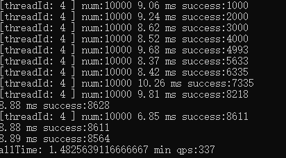  

更换了一个webapi的调用组件后，成功率终于到了一个正常的水平。
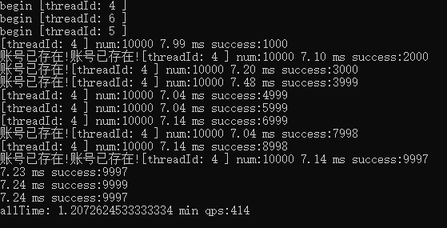  


老的注册代码

``` c#

static bool login(string userName, string password)
{
    var url = "http://localhost:5000/api/Account/CreateAccount";

    var client = new RestClient(url);

    var request = new RestRequest(Method.POST);
    request.AddJsonBody(new
    {
        Name = userName,
        Password = password
    });

    var ret = client.Execute(request);
    if (ret.StatusCode == System.Net.HttpStatusCode.OK)
    {
        // Console.WriteLine(ret.Content);
        return true;
    }
    else
    {
        Console.Write(ret.StatusCode);
    }
    return false;
}

```

新的注册代码

``` c#

HttpJsonClient client = new HttpJsonClient("http://localhost:5000");

client.SetBody(new
{
    Name = userName,
    Password = password
});

var result = client.Post("/api/Account/CreateAccount").Result;
JToken rdata = result.GetResult<JToken>();
if(rdata["code"].ToString() == "0")
{
    return true;
}
else
{
    Console.Write(rdata["errorMessage"]);
}

return false;

```

使用 RestClient 整个组件，在创建到一定数量后，应该是系统资源没有能及时回收，导致后面的执行请求失败。试着将 RestClient 作为静态变量来创建和使用，结果也还是一样的。

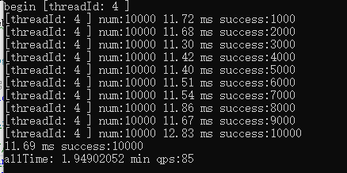  
随后，用单线程跑了一次，结果，让人大感失望。不过，从数据上看，也还是正常的，单词的时间为12ms，单线程可不是80多的qps。如果要提高系统的qps，一个是多线程运行，一个是缩短单次执行的时间。

这次，用了15个测试线程来执行，除了中间有一次硬盘IO的写入，导致整个系统的卡顿，有了一次17ms的平均请求外，基本的平均请求在14ms下。
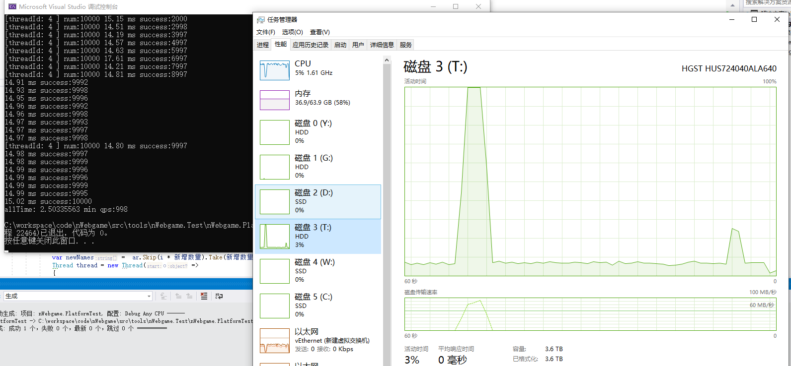  

以上测试环境为 e5-2650v2 mysql 是在8核4G虚拟机的docker里运行。服务端与测试端均在win10系统下执行。


