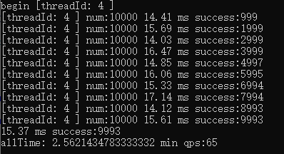

# 单线程的性能进化


昨天单线程下，单次请求耗时12ms左右，如果要提高qps，首先要优化的是提升单次请求的速度，现在先看一下，不带任何db的请求耗时，用于统计webapi请求时的网络开销。

  


1.5ms 的网络网络请求时间，也就是理论上两次数据库查询的时候耗时在10ms，单次耗时5ms，符合之前对mysql的印象。
但是，现在数据库请求是带事务的请求，试试看不带事务的请求耗时。

  

最快11ms，比之前单独测试少了1ms，因为每次提交保存，ef或者mysql，都将其视为一次事务，所以，首次对用户名进行账户查询是否存在的操作，并没有带来多少的性能提升。
因此，下一步是看，通过ef生成的sql语句，是否存在问题。

```

Microsoft.EntityFrameworkCore.Infrastructure: Information: Entity Framework Core 5.0.4 initialized 'DBSet' using provider 'MySql.EntityFrameworkCore' with options: None
Microsoft.EntityFrameworkCore.Database.Connection: Debug: Opening connection to database '11' on server '192.168.1.62'.
Microsoft.EntityFrameworkCore.Database.Connection: Debug: Opened connection to database '11' on server '192.168.1.62'.
Microsoft.EntityFrameworkCore.Database.Transaction: Debug: Beginning transaction with isolation level 'Unspecified'.
Microsoft.EntityFrameworkCore.Database.Transaction: Debug: Began transaction with isolation level 'RepeatableRead'.
Microsoft.EntityFrameworkCore.Database.Command: Debug: Creating DbCommand for 'ExecuteReader'.
Microsoft.EntityFrameworkCore.Database.Command: Debug: Created DbCommand for 'ExecuteReader' (2ms).
Microsoft.EntityFrameworkCore.Database.Command: Debug: Executing DbCommand [Parameters=[@__request_Name_0='?' (Size = 4000)], CommandType='Text', CommandTimeout='30']
SELECT `p`.`Id`, `p`.`Extend1`, `p`.`Extend2`, `p`.`Extend3`, `p`.`Extend4`, `p`.`Extend5`, `p`.`Extend6`, `p`.`Extend7`, `p`.`Extend8`, `p`.`Extend9`, `p`.`Mobile`, `p`.`Name`, `p`.`Password`, `p`.`iExtend1`, `p`.`iExtend2`, `p`.`iExtend3`, `p`.`iExtend4`, `p`.`iExtend5`, `p`.`iExtend6`, `p`.`iExtend7`, `p`.`iExtend8`, `p`.`iExtend9`
FROM `PlatformAccounts` AS `p`
WHERE `p`.`Name` = @__request_Name_0
LIMIT 1
Microsoft.EntityFrameworkCore.Database.Command: Information: Executed DbCommand (4ms) [Parameters=[@__request_Name_0='?' (Size = 4000)], CommandType='Text', CommandTimeout='30']
SELECT `p`.`Id`, `p`.`Extend1`, `p`.`Extend2`, `p`.`Extend3`, `p`.`Extend4`, `p`.`Extend5`, `p`.`Extend6`, `p`.`Extend7`, `p`.`Extend8`, `p`.`Extend9`, `p`.`Mobile`, `p`.`Name`, `p`.`Password`, `p`.`iExtend1`, `p`.`iExtend2`, `p`.`iExtend3`, `p`.`iExtend4`, `p`.`iExtend5`, `p`.`iExtend6`, `p`.`iExtend7`, `p`.`iExtend8`, `p`.`iExtend9`
FROM `PlatformAccounts` AS `p`
WHERE `p`.`Name` = @__request_Name_0
LIMIT 1
Microsoft.EntityFrameworkCore.Database.Command: Debug: A data reader was disposed.
Microsoft.EntityFrameworkCore.ChangeTracking: Debug: 'DBSet' generated a temporary value for the property 'Id.PlatformAccount'. Consider using 'DbContextOptionsBuilder.EnableSensitiveDataLogging' to see key values.
Microsoft.EntityFrameworkCore.ChangeTracking: Debug: Context 'DBSet' started tracking 'PlatformAccount' entity. Consider using 'DbContextOptionsBuilder.EnableSensitiveDataLogging' to see key values.
Microsoft.EntityFrameworkCore.Update: Debug: SaveChanges starting for 'DBSet'.
Microsoft.EntityFrameworkCore.ChangeTracking: Debug: DetectChanges starting for 'DBSet'.
Microsoft.EntityFrameworkCore.ChangeTracking: Debug: DetectChanges completed for 'DBSet'.
Microsoft.EntityFrameworkCore.Database.Transaction: Debug: Creating transaction savepoint.
Microsoft.EntityFrameworkCore.Database.Transaction: Debug: Created transaction savepoint.
Microsoft.EntityFrameworkCore.Database.Command: Debug: Creating DbCommand for 'ExecuteReader'.
Microsoft.EntityFrameworkCore.Database.Command: Debug: Created DbCommand for 'ExecuteReader' (2ms).
Microsoft.EntityFrameworkCore.Database.Command: Debug: Executing DbCommand [Parameters=[@p0='?' (Size = 4000), @p1='?' (Size = 4000), @p2='?' (Size = 4000), @p3='?' (Size = 4000), @p4='?' (Size = 4000), @p5='?' (Size = 4000), @p6='?' (Size = 4000), @p7='?' (Size = 4000), @p8='?' (Size = 4000), @p9='?' (Size = 4000), @p10='?' (Size = 4000), @p11='?' (Size = 4000), @p12='?' (DbType = Int32), @p13='?' (DbType = Int32), @p14='?' (DbType = Int32), @p15='?' (DbType = Int32), @p16='?' (DbType = Int32), @p17='?' (DbType = Int32), @p18='?' (DbType = Int32), @p19='?' (DbType = Int32), @p20='?' (DbType = Int32)], CommandType='Text', CommandTimeout='30']
INSERT INTO `PlatformAccounts` (`Extend1`, `Extend2`, `Extend3`, `Extend4`, `Extend5`, `Extend6`, `Extend7`, `Extend8`, `Extend9`, `Mobile`, `Name`, `Password`, `iExtend1`, `iExtend2`, `iExtend3`, `iExtend4`, `iExtend5`, `iExtend6`, `iExtend7`, `iExtend8`, `iExtend9`)
VALUES (@p0, @p1, @p2, @p3, @p4, @p5, @p6, @p7, @p8, @p9, @p10, @p11, @p12, @p13, @p14, @p15, @p16, @p17, @p18, @p19, @p20);
SELECT `Id`
FROM `PlatformAccounts`
WHERE ROW_COUNT() = 1
 AND `Id`=LAST_INSERT_ID();
Microsoft.EntityFrameworkCore.Database.Command: Information: Executed DbCommand (5ms) [Parameters=[@p0='?' (Size = 4000), @p1='?' (Size = 4000), @p2='?' (Size = 4000), @p3='?' (Size = 4000), @p4='?' (Size = 4000), @p5='?' (Size = 4000), @p6='?' (Size = 4000), @p7='?' (Size = 4000), @p8='?' (Size = 4000), @p9='?' (Size = 4000), @p10='?' (Size = 4000), @p11='?' (Size = 4000), @p12='?' (DbType = Int32), @p13='?' (DbType = Int32), @p14='?' (DbType = Int32), @p15='?' (DbType = Int32), @p16='?' (DbType = Int32), @p17='?' (DbType = Int32), @p18='?' (DbType = Int32), @p19='?' (DbType = Int32), @p20='?' (DbType = Int32)], CommandType='Text', CommandTimeout='30']
INSERT INTO `PlatformAccounts` (`Extend1`, `Extend2`, `Extend3`, `Extend4`, `Extend5`, `Extend6`, `Extend7`, `Extend8`, `Extend9`, `Mobile`, `Name`, `Password`, `iExtend1`, `iExtend2`, `iExtend3`, `iExtend4`, `iExtend5`, `iExtend6`, `iExtend7`, `iExtend8`, `iExtend9`)
VALUES (@p0, @p1, @p2, @p3, @p4, @p5, @p6, @p7, @p8, @p9, @p10, @p11, @p12, @p13, @p14, @p15, @p16, @p17, @p18, @p19, @p20);
SELECT `Id`
FROM `PlatformAccounts`
WHERE ROW_COUNT() = 1
 AND `Id`=LAST_INSERT_ID();
Microsoft.EntityFrameworkCore.ChangeTracking: Debug: The foreign key property 'PlatformAccount.Id' was detected as changed. Consider using 'DbContextOptionsBuilder.EnableSensitiveDataLogging' to see property values.
Microsoft.EntityFrameworkCore.Database.Command: Debug: A data reader was disposed.
Microsoft.EntityFrameworkCore.Database.Transaction: Debug: Releasing transaction savepoint.
Microsoft.EntityFrameworkCore.Database.Transaction: Debug: Released transaction savepoint.
Microsoft.EntityFrameworkCore.ChangeTracking: Debug: An entity of type 'PlatformAccount' tracked by 'DBSet' changed state from 'Added' to 'Unchanged'. Consider using 'DbContextOptionsBuilder.EnableSensitiveDataLogging' to see key values.
Microsoft.EntityFrameworkCore.Update: Debug: SaveChanges completed for 'DBSet' with 1 entities written to the database.
Microsoft.EntityFrameworkCore.Database.Transaction: Debug: Committing transaction.
Microsoft.EntityFrameworkCore.Database.Transaction: Debug: Committed transaction.
Microsoft.EntityFrameworkCore.Database.Connection: Debug: Closing connection to database '11' on server '192.168.1.62'.
Microsoft.EntityFrameworkCore.Database.Connection: Debug: Closed connection to database '11' on server '192.168.1.62'.
Microsoft.EntityFrameworkCore.Database.Transaction: Debug: Disposing transaction.
Microsoft.EntityFrameworkCore.Infrastructure: Debug: 'DBSet' disposed.

```

上面是一个完整的的查询请求记录下来的日志信息

~~~  sql

SELECT `p`.`Id`, `p`.`Extend1`, `p`.`Extend2`, `p`.`Extend3`, `p`.`Extend4`, `p`.`Extend5`, `p`.`Extend6`, `p`.`Extend7`, `p`.`Extend8`, `p`.`Extend9`, `p`.`Mobile`, `p`.`Name`, `p`.`Password`, `p`.`iExtend1`, `p`.`iExtend2`, `p`.`iExtend3`, `p`.`iExtend4`, `p`.`iExtend5`, `p`.`iExtend6`, `p`.`iExtend7`, `p`.`iExtend8`, `p`.`iExtend9`
FROM `PlatformAccounts` AS `p`
WHERE `p`.`Name` = @__request_Name_0
LIMIT 1

~~~

先看一下查询语句，除了因为为了今后扩展方便，将用户表增加了很多冗余字段，导致sql查询语句比较长，返回的内容比价多外，这就是一个很标准的查询语句。c#代码里使用的是FirstOrDefault 方法进行查询，sql语句还增加了limit 1的条件，已经算是优化到了。

``` sql

INSERT INTO `PlatformAccounts` (`Extend1`, `Extend2`, `Extend3`, `Extend4`, `Extend5`, `Extend6`, `Extend7`, `Extend8`, `Extend9`, `Mobile`, `Name`, `Password`, `iExtend1`, `iExtend2`, `iExtend3`, `iExtend4`, `iExtend5`, `iExtend6`, `iExtend7`, `iExtend8`, `iExtend9`)
VALUES (@p0, @p1, @p2, @p3, @p4, @p5, @p6, @p7, @p8, @p9, @p10, @p11, @p12, @p13, @p14, @p15, @p16, @p17, @p18, @p19, @p20);
SELECT `Id`
FROM `PlatformAccounts`
WHERE ROW_COUNT() = 1
 AND `Id`=LAST_INSERT_ID();

```

而插入语句，实际上为2条sql语句，一条 insert 一条 select，先插入，然后获得自增id。


```

Microsoft.EntityFrameworkCore.Database.Command: Debug: Created DbCommand for 'ExecuteReader' (2ms).
[查询用户名的sql]
...

Microsoft.EntityFrameworkCore.Database.Command: Information: Executed DbCommand (5ms) 
[插入新用户的sql]

```

摘取了两段sql执行的时间，因为一共进行了3次sql语句，总耗时在7ms，但是，因为日志的获取是在debug模式下进行的，因此时间上可能会偏多一点点。

```

Microsoft.EntityFrameworkCore.Database.Transaction: Debug: Committing transaction.
Microsoft.EntityFrameworkCore.Database.Transaction: Debug: Committed transaction.
Microsoft.EntityFrameworkCore.Database.Connection: Debug: Closing connection to database '11' on server '192.168.1.62'.
Microsoft.EntityFrameworkCore.Database.Connection: Debug: Closed connection to database '11' on server '192.168.1.62'.
Microsoft.EntityFrameworkCore.Database.Transaction: Debug: Disposing transaction.
Microsoft.EntityFrameworkCore.Infrastructure: Debug: 'DBSet' disposed.

```

从后面的整个日志看，整个api请求结束后，会触发一次 disposing() 的方法，整个也是正常的using的操作。
从这里可以想到一种做法，就是我们能不能复用整个dbset对象，不要每次都创建与销毁。

  

  

```  c#

private Response<string> CreatAccountByUseDBSetPool(CreateAccountRequest request)
{
    var db = DBSetManager.GetByPool();

    var tran = db.Database.BeginTransaction();

    try
    {
        var exits = db.PlatformAccounts.FirstOrDefault(o => o.Name == request.Name);
        if (exits == null)
        {
            exits = new PlatformAccount
            {
                Name = request.Name,
                Password = request.Password,
            };

            db.PlatformAccounts.Add(exits);
            db.SaveChanges();
            tran.Commit();

            DBSetManager.ReleaseToPool(db);
            return new Response<string>();
        }
        else
        {
            DBSetManager.ReleaseToPool(db);
            return Response<string>.Error("账号已存在!");
        }
    }
    catch (Exception ex)
    {
        _logger.LogError(ex, "create user fail. {0}", request.Name);
        tran.Rollback();

        // 发生异常的话，dbset 我就不还了。
        return Response<string>.Error(ex.Message);
    }
}

```

这里分别跑了2次，两次的差别在tran上是否使用了using进行回收，时间少的是现在的代码，没有对事务进行回收。但从执行效果上来看，没发生什么异常的情况。性能比之前提升了2ms。目前因为数据库里的数据比较多，单次运行的时间已经到15ms了。

  

这次跑了10线程，qps进化到900了。

  

开了15个线程，也只进化到1000qps，这个时候整台机器的cpu已经满载，在单机上进行多线程测试的话，已经没优化空间了。
目前的结论是，在16核（8核16线程，但云服务器上实际上还是按照16核来卖）的cpu下，整个系统能完成1000qps的请求。

  

vmmem 是mysql所在的虚拟机，从cpu资源占用比例来看，应用程序的耗时是数据库的2倍，理论上，将数据库和应用程序拆分到不同的服务器上，单机性能还是可以有一定的提升。预计能完整使用单路 2650v2 的单路服务器，qps可以理论可以到2000qps的插入性能。
